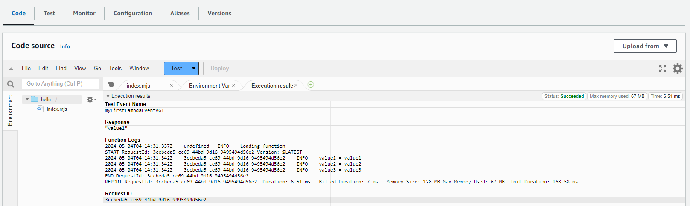

# lambda

## Create a Lambda Function

- AWS Lambda service allows me to run my code without needing to provision or configure any Servers. 
- I get billed only for the compute time my code consumes. 
- There is no charge when my code is not running. 
- Currently, it supports **Java**, **JavaScript**, **Python**, **Go**, **.Net**, and **Ruby**.
- I can even set my code to automatically trigger from other AWS services or call it directly from any web or mobile application. 
- Several sample use cases are available on the **https://aws.amazon.com/lambda/**

### Step 1. Start the AWS Lambda Service
- Go to the AWS Management Console. Navigate to the Lambda service.

### Step 2. Launch the Wizard
- I will be taken to the AWS Lambda dashboard. 
- Launch the Create function wizard.

### Step 3. Create a Function

1. AWS provides three options to get the template code of your function:
   - **Author from scratch** 
     - Start with a simple Hello World example.
   - **Use a blueprint**
     - Build a Lambda application from sample code and configuration presets for common use cases.
   - **Browse serverless app repository** 
     - Deploy a sample Lambda application from the AWS Serverless Application Repository. 
   - Select Use a blueprint to proceed and look for a Node.js hello world image in the dropdown:
     - Click on **Create function**
     - SELECT **Use a blueprint**
2. Provide basic information about my function
     - Basic information:
       - Blueprint name: *Hello world function*
       - Function name: *hello*
       - Execution role: *Create a new role with basic Lambda permissions*
         - In this case, the Lambda will create an execution role with permission to upload logs to Amazon CloudWatch Logs
       - Click on the Create function button.
       - Lambda function code:
```json
console.log('Loading function');
export const handler = async (event, context) => {
    //console.log('Received event:', JSON.stringify(event, null, 2));
    console.log('value1 =', event.key1);
    console.log('value2 =', event.key2);
    console.log('value3 =', event.key3);
    return event.key1;  // Echo back the first key value
    // throw new Error('Something went wrong');
};
```

3.  After the successful creation of the function, I see an acknowledgment. 
    - Remember, I can run my Lambda code in response to events. 
    - Now, I will have to create an Event that will trigger my code to run.

- Lambda provides a Designer user interface that allows choosing other AWS services, as event sources, to trigger my code, and use a destination (optional) of my choice to store the generated/processes output.

- In this example, let's click on the Test button to configure the test event that will be manually passed to my code.

4. The Event is represented as a JSON file. 
- Give my test event a name and set three String values of your choice in the Event: **myFirstLambdaEventAGT**. 
- A function can receive up to 10 test events. 
- I can leave the rest of the settings to their default and click Save.

### Step 4. Test Your Function
- Click on the Test button again to pass the saved event to your Lambda function. 
- And see the execution results in the console.

- Notice the **Response**, and the **Function Logs**. 
    - When I run the Test, the sample code accepts the event (JSON file) and processes the received information. 
    - In this case, I have printed all three JSON values on the console, and finally returned the first JSON value.

### Step 5. Delete a Function
- delete my function if not in use
- IAM roles - Navigate to AWS Console, in the navigation panel. Choose roles and then select the check box next to the role name that I want to delete
