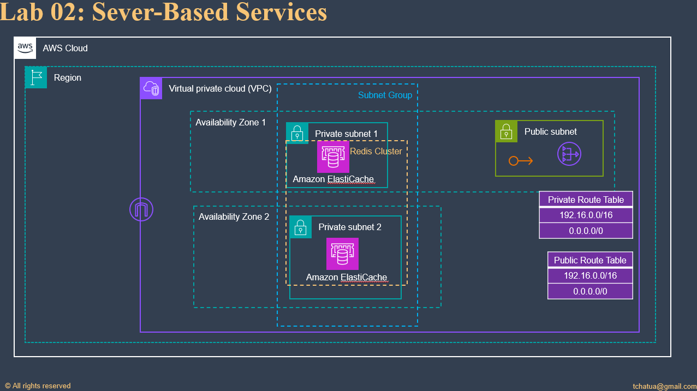

# Server-Based Services
```css
Most server-based services have similar concepts for handling a hardware failover automatically. 
This functionality is the same that handles a single availability zone failure. 
By creating active/standby pairs of servers that replicate and by having each member of the pair in a different availability zone,
I create the infrastructure that handles both of these failure modes. 
ElastiCache is one of these services.
```
## Lab: Create ElastiCache cluster and Redis cache
- Create an **ElastiCache cluster** that does not have a single point of failure, and that can handle an AZ outage.
  - First, create an **ElastiCache subnet group** in the **default VPC** using **each available subnet** 
  - and then create a **multi-AZ Redis cluster**.

## Solution:

### Server based services
  1. Create Subnet Group
  2. Go to the ElastiCache service.
  3. Select **Subnet group** -> **Create Subnet group**
  4. Name the group and give it a description
     1. subnet group: *lab02-subnet-group*
     2. description: *For lab 02*
  5. Select the default VPC
     1. For each Availability Zone, select the associated subnet and then save

### Create Redis cluster
  1. Select Redis Cache -> **Create Redis cache**
  2. Choose *Design your own cache** with **Easy create creation method**
  3. Select a **Demo configuration**
  4. Cluster info:
     1. name: *lab02-redis-cache*
  5. In the **Connectivity** menu, select the **subnet group you just created**
  6. Click **Create** and wait for the cluster to be available.
