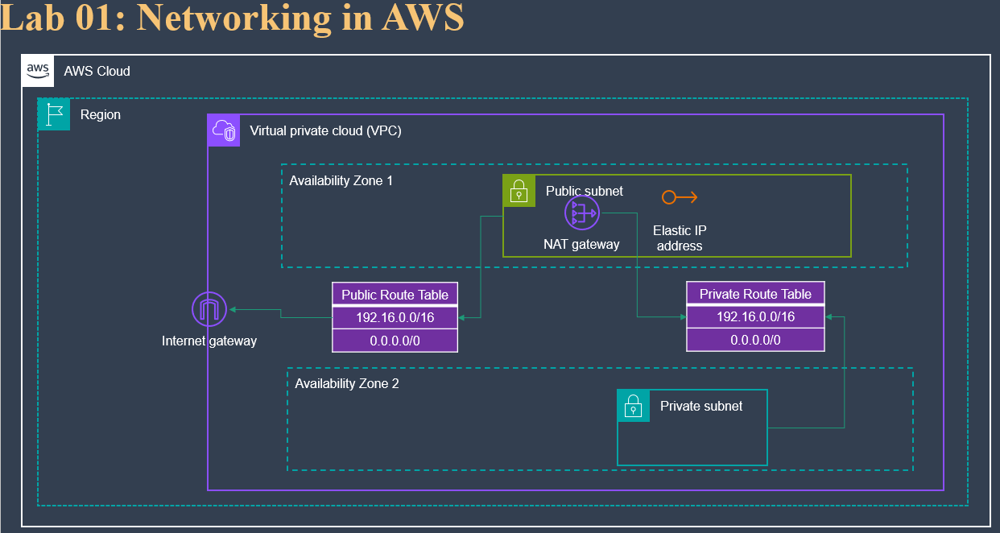

# Lab: Networking In AWS

- Networking In AWS
```
We've seen the many networking options that are available in AWS. 
These network options exist to provide flexibility but also support important business needs, 
such as security and network architecture best practices.

In this lab, I will use some of the more advanced networking options in order to create a subnet so that resources in this subnet will be able to access the Internet, 
but will not be directly accessible from the Internet. 
This configuration allows me to put resources an additional layer deeper within my network. 

Security has a concept referred to as "defense in depth," 
which promotes multiple layers of defense such that a compromise of any one layer does not expose important assets.
```

- The lab
```
Imagine a scenario where I have already created your VPC, 
which consists of several public and private subnets. 
I decided that the private subnet now needs internet connectivity, so you must attach a NAT gateway.

My task is to create a VPC without a NAT gateway that has at least one public and one private subnet, 
then create the NAT gateway separately and set up the route tables for the private subnet.

Here are more precise instructions for the lab:
```

## Step 1: Create a VPC with subnets
1. Go to the AWS Management Console.
2. Navigate to the VPC Dashboard.
3. Click on the **"Create VPC"**
   1. Select the "VPC and more" option.
   2. Name the VPC: "grace-vpc-demo"
   3. Choose 1 AZ, 1 public subnet, and 1 private subnet
   4. Choose None for the NAT Gateway
   5. Create the VPC

## Step 2: Create a NAT Gateway and Update Route Table
1. In the VPC Dashboard, go to **"NAT gateways"** in the left navigation panel.
   - Click **"Create NAT gateway"**
   - Select the **public subnet** you just created
   - Choose an **Elastic IP** address or **Allocate a new one**
   - Click **"Create NAT Gateway"**
2. Once the NAT Gateway is available, go to **"Route Tables"**.
   - Identify the route table associated with the private subnet
   - Go to **Routes** and click on **Edit Routes**
   - Add a default route pointing to the new **NAT Gateway**:
```css
Destination     Target
0.0.0.0/0       nat-xxxxxxxxxxxxxxxxx (NAT Gateway ID)
```
## Conclusion:
```
At this point, 
I have created a VPC with two subnets (public and private) and set up a NAT Gateway for Internet access from the private subnet. 
This configuration ensures that resources in the private subnet can access the Internet but are not directly accessible from the Internet.
```
